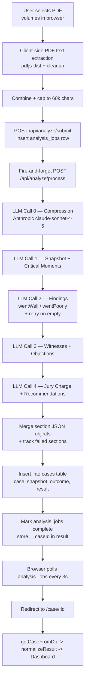

# VerdictIQ — Architecture

This document describes how a litigation transcript flows from upload to a
persisted, defense-oriented case analysis. It is intended for technical
review; no application code is changed by this document.

## 1. High-level pipeline



The browser owns PDF parsing and progress polling. The Cloudflare Worker
runtime (TanStack Start server route) owns LLM orchestration and DB writes.
All persistence is in Lovable Cloud (Supabase) — `analysis_jobs` for
in-flight progress, `cases` for the durable library.

## 2. Pipeline stages

| # | Stage | File | Function / Symbol |
|---|-------|------|-------------------|
| 1 | File selection (drag/drop, multi-volume PDF) | `src/components/verdict/UploadZone.tsx` | `UploadZone` |
| 2 | Client-side PDF text extraction | `src/lib/pdf-extract.ts` | `extractPdfText` |
| 3 | Reporter-noise cleanup (line numbers, certificate boilerplate, whitespace) | `src/lib/pdf-extract.ts` | `cleanTranscript` |
| 4 | Combine multi-volume output and cap at 60,000 chars | `src/lib/pdf-extract.ts` | `combineAndCap` (`MAX_CHARS = 60_000`) |
| 5 | Form orchestration (validate, submit, navigate) | `src/routes/new.tsx` | `NewAnalysisPage.handleAnalyze` |
| 6 | Submit job (insert pending row, server-side re-clean + cap to 60k) | `src/routes/api/analyze.submit.ts` | route `POST` handler + `cleanTranscript` (server copy) |
| 7 | Client kicks background processor | `src/lib/analyze-client.ts` | `submitAnalysis` |
| 8 | Background worker (compression + 4 sections + persistence) | `src/routes/api/analyze.process.ts` | `runJob` (called from route `POST` handler) |
| 8a | Single Anthropic HTTP call wrapper | `src/routes/api/analyze.process.ts` | `callClaude` |
| 8b | Tolerant JSON extractor (strips ```json fences, slices `{…}`) | `src/routes/api/analyze.process.ts` | `extractJSON` |
| 8c | Progress writes to `analysis_jobs` | `src/routes/api/analyze.process.ts` | `updateJob` |
| 9 | Persist completed analysis to library | `src/routes/api/analyze.process.ts` | `runJob` (insert into `cases`) |
| 10 | Browser progress polling (every 3s, 5-min timeout) | `src/lib/analyze-client.ts` | `pollJob` |
| 11 | Progress UI | `src/routes/analyzing.$jobId.tsx` | `AnalyzingPage` |
| 12 | Load persisted case by id | `src/lib/cases-db.ts` | `getCaseFromDb` |
| 13 | Shape-normalize Claude output → `AnalysisResult` | `src/lib/normalize-result.ts` | `normalizeResult` |
| 14 | Render the analysis | `src/routes/case.$id.tsx` → `src/components/verdict/Dashboard.tsx` | `CasePage`, `Dashboard` |
| 15 | Library / dashboard listing | `src/routes/index.tsx` + `src/lib/cases-db.ts` | `listCasesFromDb` |

## 3. LLM calls

All LLM work happens in `src/routes/api/analyze.process.ts`. There is exactly
one provider and one model used everywhere:

- Provider: Anthropic Messages API (`https://api.anthropic.com/v1/messages`)
- Model: `claude-sonnet-4-5`
- Auth: `ANTHROPIC_API_KEY` env var read inside the Worker
- Wrapper: `callClaude(apiKey, system, user, maxTokens)`

There are **5 LLM calls per analysis** (one compression + four section calls),
plus an optional 6th retry call for the findings section.

| Call | Purpose | System prompt | User prompt | max_tokens | Defined at |
|------|---------|---------------|-------------|------------|------------|
| 0 — Compression | Reduce raw transcript to a dense, fact-preserving summary | Inline string `"You produce dense, faithful litigation summaries."` | `COMPRESSION_PROMPT` constant + `FRAMING` + case label + raw transcript | 2000 | `analyze.process.ts` (`COMPRESSION_PROMPT`, lines ~34-47; call site in `runJob`) |
| 1 — Snapshot + Critical Moments | `caseSnapshot` (court, parties, posture, filed, outcome, bottomLine) and `criticalMoments[]` | `SYSTEM_PROMPT` (with `FRAMING` baked in) | `FRAMING` + section schema + summary | 3000 | `SECTIONS[0]` ("snapshot"), schema inline |
| 2 — Findings | `wentWell[]` and `wentPoorly[]` (defense-framed) | `SYSTEM_PROMPT` | `FRAMING` + `instructions` + schema + summary | 3000 | `SECTIONS[1]` ("findings") |
| 2b — Findings retry (conditional) | Re-prompt with simpler instructions and a 20k-char trimmed summary if either array came back empty | `SYSTEM_PROMPT` | Inline `retryPrompt` demanding 3-5 items each | 3000 | `runJob` retry block, label `findings_retry` |
| 3 — Witnesses + Objections | `witnesses[]` (credibility, best/worst moment, strategic value) and `objections[]` | `SYSTEM_PROMPT` | `FRAMING` + `instructions` + schema + summary | 3000 | `SECTIONS[2]` ("witnesses") |
| 4 — Jury charge + Recommendations | `juryChargeIssues[]` and `recommendations[]` (defense-only advice) | `SYSTEM_PROMPT` | `FRAMING` + `instructions` + schema + summary | 3000 | `SECTIONS[3]` ("recommendations") |

Defense-framing is centralised in two constants and prepended to every prompt:
- `DEFENSE_FRAMING` — the "we are defense counsel" instruction block.
- `SYSTEM_PROMPT` — the senior-trial-attorney persona, JSON-only contract, and
  enum constraints (`credibility`, `ruling`).
- `FRAMING` is selected from `ROLE_FRAMING[USER_ROLE]` where `USER_ROLE` comes
  from `src/lib/user-role.ts` and is currently hard-coded to `"defense"`.

## 4. Data shape between stages

### 4.1 Browser → submit endpoint

`POST /api/analyze/submit` body (validated by Zod `InputSchema`):

```ts
{ caseName: string (1..300), transcript: string (50..120_000) }
```

Response: `{ jobId: string (uuid) }` or `{ error: string }`.

### 4.2 `analysis_jobs` row (Supabase)

Written by `submit`, mutated by `process`, polled by the browser:

```
id              uuid
case_name       text
transcript_text text | null   -- nulled out on completion
status          'pending' | 'processing' | 'complete' | 'error'
progress        int   (0..100)
progress_message text
result          jsonb | null
failed_sections jsonb (string[])
error           text | null
```

When `status = 'complete'`, `result` is the merged analysis object plus a
helper `__caseId` field pointing at the durable `cases` row. The client
strips `__caseId` in `pollJob` before resolving.

### 4.3 Compression call I/O

- Input: case label string + cleaned-and-capped raw transcript (≤60k chars).
- Output: free-text dense summary (≤~2000 tokens).
- Failure mode: on any error, the worker falls back to `transcript.slice(0, 20_000)`.

### 4.4 Section calls I/O

Each section sends `FRAMING + instructions + schema + summary` and expects a
JSON object that matches the inline `schema` string. The four schemas, in
order, contribute these keys:

```ts
// snapshot
{ caseSnapshot: { caseName, court, posture, plaintiff, defendant, filed, outcome, bottomLine },
  criticalMoments: [{ page, parties, what, why }] }

// findings
{ wentWell:   [{ category, title, detail, cite }],
  wentPoorly: [{ category, title, detail, cite, fix }] }

// witnesses
{ witnesses:  [{ name, role, credibility: "Strong"|"Mixed"|"Weak",
                 bestMoment, worstMoment, strategicValue }],
  objections: [{ party, grounds, ruling, significance }] }

// recommendations
{ juryChargeIssues: [{ dispute, plaintiffArg, defenseArg, resolution, impact }],
  recommendations:  [string] }
```

The worker `Object.assign`s each parsed section into a single `merged` object,
substituting `section.fallback` (same shape, empty arrays/strings) on
per-section failure and recording the section key in `failed_sections`.

### 4.5 `cases` row (durable library)

Inserted at the end of `runJob`:

```
id            uuid
case_name     text
job_id        uuid (references analysis_jobs.id)
result        jsonb     -- the full merged analysis object
case_snapshot jsonb     -- denormalised copy of result.caseSnapshot
outcome       text|null -- denormalised copy of caseSnapshot.outcome
starred       bool      default false
archived      bool      default false
```

`case_snapshot` and `outcome` are duplicated out of `result` so the dashboard
list query stays small (`listCasesFromDb` selects only those columns).

### 4.6 Read path → UI

`getCaseFromDb(id)` reads `result` jsonb and feeds it through
`normalizeResult` (`src/lib/normalize-result.ts`), which:
- coerces every `caseSnapshot` field to a string (defaulting to `""`);
- ensures every array key (`wentWell`, `wentPoorly`, `criticalMoments`,
  `witnesses`, `objections`, `juryChargeIssues`, `recommendations`) is an
  array, replacing missing/non-array values with `[]` and recording the key
  in `missing`;
- returns `{ result: AnalysisResult, missing: string[] }`.

The resulting `StoredCase` (typed in `src/lib/analysis-types.ts`) is handed
to `Dashboard` for rendering.

## 5. Document classification and routing logic

There is **no document-type classifier** in the pipeline. Specifically:

- The upload zone (`UploadZone`) accepts only PDFs (`application/pdf` /
  `.pdf` extension); anything else is dropped silently at file-pick time.
- Multi-volume support is just file-name+size de-duplication — no per-volume
  semantic tagging.
- No model is asked "what kind of document is this?" before analysis. Every
  upload is treated as a litigation transcript and run through the same
  compression + 4-section pipeline.
- The only post-LLM categorisation that exists is a fixed enum list embedded
  in the `findings` prompt:
  - `wentWell` categories: `Cross-Examination | Impeachment | Evidence | Witness Testimony | Objection | Jury Charge | Strategy`
  - `wentPoorly` categories: `Cross-Examination | Witness Preparation | Evidence | Objection | Strategy | Damages`
  These are returned per finding card in the `category` field and used purely
  for UI grouping in `Dashboard`.
- The closest thing to "routing" is the perspective switch in
  `src/lib/user-role.ts`: `USER_ROLE` selects which framing block from
  `ROLE_FRAMING` is prepended to every prompt. Today only `"defense"` is
  wired up; adding `"plaintiff"` would require a second framing string and a
  branch in `isOurWitness`.

If document-type classification (e.g. transcript vs. deposition vs. motion)
is ever needed, the natural insertion point is between stages 4 (combine/cap)
and 6 (submit) — either as a small client-side heuristic on the extracted
text or as a new lightweight LLM call in `analyze.process.ts` before the
compression step.
